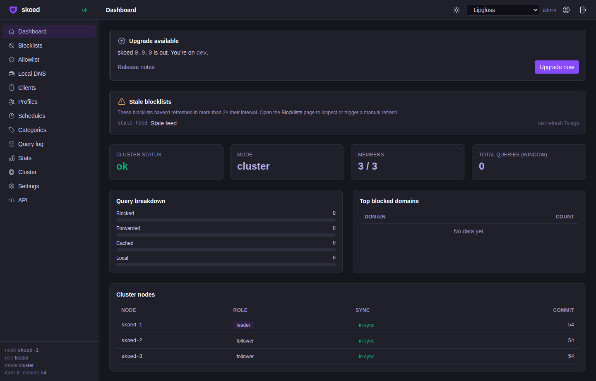

# skoed

**Self-hosted DNS filtering with multi-node sync**

[](https://github.com/ashmonger/skoed/actions/workflows/ci.yml)
[](https://github.com/ashmonger/skoed/releases)
[](https://github.com/ashmonger/skoed/pkgs/container/skoed)
[](LICENSE)

skoed is a single-binary, self-hosted DNS filter and sinkhole. It replaces Pi-Hole and AdGuard Home with native multi-node Raft clustering, encrypted DNS protocols, and a built-in web UI — all in a statically linked Go binary with no runtime dependencies.



---

## 30-second quickstart

```bash
docker run -d \
  --name skoed \
  -p 53:53/udp -p 53:53/tcp -p 8080:8080 \
  ghcr.io/ashmonger/skoed:latest
```

Open `http://localhost:8080` to complete first-run setup.

---

## Features

### DNS
- DNS-over-HTTPS (RFC 8484), DNS-over-TLS (RFC 7858), DoH3, and DNSCrypt server
- Encrypted upstream resolvers: DoH, DoT, DoH3, and DNSCrypt
- Local DNS records, per-client overrides, and recursive resolution mode
- DNS cache with configurable TTL and manual flush

### Filtering
- Blocklist and allowlist management with automatic refresh
- Per-client profiles with custom filter rules
- Schedules and parental controls
- Category-based filtering
- Query log with full request/response detail

### UI and API
- Vue 3 + Vite web UI embedded in the binary
- REST management API with Swagger UI
- API token authentication
- Prometheus `/metrics` endpoint
- Audit log

### Cluster
- Multi-node Raft consensus — any node accepts writes, followers proxy to leader
- Single-use join tokens for safe node enrolment
- mTLS cluster mesh (mutual TLS between nodes)
- Kubernetes operator with `SkoedCluster` and `SkoedNode` CRDs

### Deployment
- Statically linked binary (Alpine/musl compatible)
- Debian/Ubuntu `.deb` package
- Alpine Linux `.apk` package
- Docker image and Helm chart
- Proxmox LXC provisioning script

### Integrations
- DHCP lease import for client identity (dnsmasq and Kea)
- CLI: `skoed status`, `skoed token create`, `skoed domain`
- TUI dashboard: `skoed top`

---

## Installation

> **Note:** Commands below use version `0.5.0` as an example. Check the [releases page](https://github.com/ashmonger/skoed/releases) for the latest version.

| Method | Platform | Command |
|--------|----------|---------|
| **Docker** | Any | `docker run -d -p 53:53/udp -p 53:53/tcp -p 8080:8080 ghcr.io/ashmonger/skoed:latest` |
| **Debian / Ubuntu** | x86-64, arm64 | `wget https://github.com/ashmonger/skoed/releases/download/v0.5.0/skoed_0.5.0_amd64.deb && sudo dpkg -i skoed_0.5.0_amd64.deb` |
| **Alpine Linux** | x86-64, arm64 | `wget https://github.com/ashmonger/skoed/releases/download/v0.5.0/skoed_0.5.0_amd64.apk && apk add --allow-untrusted skoed_0.5.0_amd64.apk` |
| **Helm (Kubernetes)** | Kubernetes 1.24+ | `helm install skoed oci://ghcr.io/ashmonger/charts/skoed` |
| **Proxmox LXC** | Proxmox VE | `./scripts/proxmox-create.sh --id 200 --hostname skoed-1 --deb skoed_0.5.0_amd64.deb` |

After installing the `.deb` package, skoed starts automatically as a systemd service. Complete first-run setup at `http://<host>:8080`.

---

## Cluster quickstart

Bootstrap a 3-node cluster by starting the first node, generating a join token, then starting the remaining nodes with that token.

**Step 1 — Start node 1 (bootstrap node)**

```yaml
# /etc/skoed/config.yaml on node-1
node:
  id: skoed-1
  raft_address: 192.168.1.10:7000
  api_address: 0.0.0.0:8080
  data_dir: /var/lib/skoed
```

```bash
systemctl restart skoed
```

**Step 2 — Generate a join token from node 1**

```bash
skoed token create --api http://192.168.1.10:8080
```

The command prints a `bootstrap:` block to paste into each joining node's config:

```yaml
bootstrap:
  leader_address: http://192.168.1.10:8080
  token:          <single-use-token>
```

**Step 3 — Start nodes 2 and 3**

Paste the `bootstrap:` block into `/etc/skoed/config.yaml` on each joining node, set a unique `id` and `raft_address`, then start the service:

```yaml
# /etc/skoed/config.yaml on node-2
node:
  id: skoed-2
  raft_address: 192.168.1.11:7000
  api_address: 0.0.0.0:8080
  data_dir: /var/lib/skoed

bootstrap:
  leader_address: http://192.168.1.10:8080
  token:          <single-use-token>
```

```bash
systemctl restart skoed
```

Repeat for node 3 with a fresh token (tokens are single-use). All nodes synchronise via Raft once enrolled.

---

## Configuration

skoed is configured through `/etc/skoed/config.yaml`. The installed package ships a documented example at `/etc/skoed/config.yaml` covering single-node, cluster, mTLS, DHCP integration, and HTTPS API options. For the full configuration reference, see the [documentation](https://ashmonger.github.io/skoed).

---

## Documentation

Full documentation is available at **[https://ashmonger.github.io/skoed](https://ashmonger.github.io/skoed)**.

---

## License

MIT — see [LICENSE](LICENSE).
